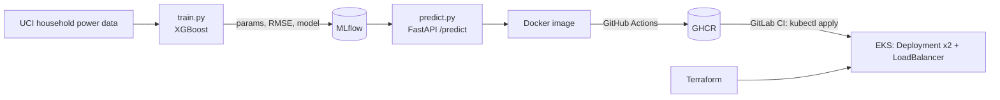

# MLOps Electricity Demand Forecasting

A minimal end-to-end MLOps scaffold for forecasting household electricity demand: XGBoost training tracked in MLflow, a FastAPI prediction service, Docker packaging, GitHub Actions CI that pushes to GHCR, and Kubernetes manifests deployed to Amazon EKS through GitLab CI.


## What it does

1. **Train** (`ml/train.py`): loads the UCI *Individual Household Electric Power Consumption* dataset, builds calendar features (hour, day of week, month), fits an `XGBRegressor` (200 trees, lr 0.1) on an 80/20 chronological split, and logs parameters, RMSE and the model to MLflow.
2. **Serve** (`ml/predict.py`): FastAPI app with `POST /predict` that takes a timestamp and returns predicted `Global_active_power` (kW).
3. **Package**: `Dockerfile` builds a `python:3.10-slim` image running Uvicorn on port 8000.
4. **CI** (`.github/workflows/ci.yml`): installs dependencies, runs `pytest ci/tests/`, builds the image and pushes it to `ghcr.io/<user>/mlops-electricity-demand:latest`.
5. **CD** (`.gitlab-ci.yml`): updates kubeconfig for the `mlops-cluster` EKS cluster and applies the Deployment (2 replicas) and LoadBalancer Service.
6. **Infra** (`infra/main.tf`): EKS cluster via the `terraform-aws-modules/eks/aws` module.



## API

```bash
curl -X POST http://localhost:8000/predict \
  -H "Content-Type: application/json" \
  -d '{"datetime": "2006-12-16 17:24:00"}'
# {"prediction": <kW>}
```

## Run locally

```bash
pip install -r ml/requirements.txt

# 1. Download the dataset (UCI ID 235) and save it as data/household_power.txt
#    https://archive.ics.uci.edu/dataset/235/individual+household+electric+power+consumption

# 2. Train and log to MLflow
python ml/train.py
mlflow ui            # note the run ID

# 3. Put the run ID into ml/predict.py ("runs:/<your_run_id>/model"), then serve
uvicorn ml.predict:app --port 8000
```

## Project structure

```
├── .github/workflows/ci.yml   # test, build, push to GHCR
├── .gitlab-ci.yml             # deploy to EKS
├── Dockerfile
├── ci/tests/                  # pytest for train + predict
├── infra/main.tf              # EKS via terraform-aws-modules
├── k8s/                       # deployment.yaml, service.yaml
└── ml/                        # train.py, predict.py, requirements.txt
```

## Status and known gaps

This is a scaffold, not a running deployment. Before it works end to end:

- `data/household_power.textClipping` is a macOS clipping file, not the dataset. The real file must be downloaded (see above) and is too large to commit.
- `ml/predict.py` loads a hard-coded `runs:/<your_run_id>/model`; it should load from the MLflow Model Registry (e.g. `models:/household-power/Production`).
- `infra/main.tf` contains placeholder VPC and subnet IDs, and the `subnets` argument was renamed `subnet_ids` in recent versions of the EKS module.
- `k8s/deployment.yaml` still has `<your-username>` in the image path.
- `ci/scripts/*.sh` and `ci/pytest.ini` are empty placeholders.
- With only calendar features, the model cannot see recent load; adding lag features (t-1h, t-24h, t-168h) is the obvious next improvement.

## Dataset

Hébrail, G. & Bérard, A. (2006). *Individual Household Electric Power Consumption* [Dataset]. UCI Machine Learning Repository. https://doi.org/10.24432/C58K54

## Author

Faiz Hussain
